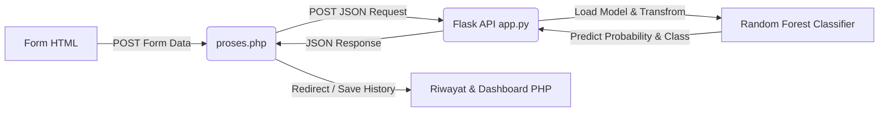

# Dokumentasi Teknis Aplikasi Web BlekpinkFlight

Dokumen ini menjelaskan arsitektur teknis, endpoint, rekayasa fitur dinamis, dan integrasi model machine learning pada backend Flask untuk aplikasi prediksi keterlambatan penerbangan (*Flight Delay Prediction*).

---

## 1. Arsitektur Sistem

Aplikasi ini menggunakan arsitektur klien-server sederhana dengan komponen sebagai berikut:
- **Frontend**: Menggunakan HTML/CSS (dengan styling TailwindCSS) pada berkas `form.html` untuk menerima input pengguna.
- **Controller PHP**: Menggunakan berkas PHP (`proses.php`, `index.php`, dsb.) untuk menangani logika sesi, interaksi database, dan berkomunikasi dengan server backend via request HTTP POST.
- **Backend Machine Learning**: Ditenagai oleh **Flask (Python)** pada berkas `app.py`. Flask bertindak sebagai microservice API yang bertugas memproses data input, melakukan transformasi preprocessing, dan mengeksekusi prediksi menggunakan model Random Forest Classifier.



---

## 2. Struktur Berkas Backend

Backend Flask berjalan di dalam direktori `ProjectPASD` dan bergantung pada berkas-berkas berikut:
- **`app.py`**: Berkas utama yang mendefinisikan routing Flask, memuat model, dan memproses data masukan.
- **`model_random_forest_flight.pkl`**: Model Random Forest Classifier biner (Output: `0` untuk Tepat Waktu, `1` untuk Terlambat) yang dilatih dengan parameter `n_estimators=200` dan penyeimbang bobot kelas (`class_weight='balanced'`).
- **`scaler_flight.pkl`**: Berkas `StandardScaler` dari scikit-learn untuk menstandarisasi fitur numerik (`Distance` dan `Month`).
- **Label Encoders (`.pkl`)**:
  - `le_airline.pkl`: Mengodekan maskapai penerbangan.
  - `le_departure_airport.pkl`: Mengodekan bandara keberangkatan (*Origin*).
  - `le_arrival_airport.pkl`: Mengodekan bandara tujuan (*Destination*).
  - `le_rain_category.pkl`: Mengodekan kategori curah hujan.
  - `le_winter.pkl`: Mengodekan status musim salju.
- **`airports.csv`**: Database koordinat bandara dari OurAirports yang berisi data latitude dan longitude dari setiap IATA code bandara di AS.

---

## 3. Spesifikasi Endpoint API

Backend Flask menyediakan satu endpoint utama untuk memprediksi keterlambatan penerbangan.

### Endpoint: `/predict_api`
- **Method**: `POST`
- **Content-Type**: `application/json`

#### Request Payload (JSON)
Format data yang dikirim oleh server PHP ke backend Flask:
```json
{
  "maskapai": "Delta Air Lines Inc",
  "asal": "JFK",
  "tujuan": "LAX",
  "jam": "14:30"
}
```

#### Logika Pengolahan Fitur di Backend (app.py)
Saat request diterima, Flask melakukan rekayasa fitur dinamis (*Dynamic Feature Engineering*) untuk mencocokkan input dengan format latihan model:
1. **Ekstraksi Bulan (`Month`)**: Bulan keberangkatan didefinisikan secara dinamis menggunakan bulan berjalan saat transaksi terjadi (`datetime.now().month`).
2. **Kategori Curah Hujan (`Rain Category`)**: Karena form tidak menginput cuaca secara langsung, curah hujan didefaultkan ke `'Tidak Hujan'`.
3. **Status Musim Dingin (`Winter`)**: Dihitung secara otomatis. Jika bulan berjalan berada pada Desember, Januari, atau Februari (`[12, 1, 2]`), status diisi `'Ya'`, selain itu `'Tidak'`.
4. **Jarak Geodesik (`Distance`)**: Menghitung jarak penerbangan dalam kilometer menggunakan koordinat dari `airports.csv` dengan rumus matematika **Haversine**:
   $$d = 2r \arcsin\left(\sqrt{\sin^2\left(\frac{\Delta \phi}{2}\right) + \cos(\phi_1)\cos(\phi_2)\sin^2\left(\frac{\Delta \lambda}{2}\right)}\right)$$
   di mana $\phi$ adalah latitude, $\lambda$ adalah longitude, dan $r$ adalah jari-jari bumi (6371 km). Jika kode bandara tidak terdaftar, jarak default diset ke `1200.0` km.

#### Preprocessing & Prediksi
1. **Label Encoding**: Fitur kategori (`Airline`, `Departure Airport`, `Arrival Airport`, `Rain Category`, `Winter`) dikonversi ke kode numerik menggunakan `LabelEncoder` masing-masing yang telah dimuat.
2. **Feature Scaling**: Fitur numerik (`Distance` dan `Month`) distandarisasi menggunakan `StandardScaler` (`scaler_flight.pkl`).
3. **Inference**: Menggabungkan seluruh fitur ke dalam struktur array 2D dengan urutan:
   `[Airline, Departure Airport, Arrival Airport, Distance, Rain Category, Winter, Month]`
   dan mengirimkannya ke model Random Forest (`predict` dan `predict_proba`).

#### Response Payload (JSON)
Format keluaran yang dikembalikan oleh backend Flask:
```json
{
  "status": "success",
  "status_prediksi": "Tepat Waktu",
  "probabilitas": 87
}
```
*Catatan: `probabilitas` adalah persentase tingkat keyakinan prediksi kelas terpilih.*

---

## 4. Cara Menjalankan Backend Server

Pastikan pustaka pendukung seperti `Flask`, `pandas`, `numpy`, `scikit-learn`, dan `joblib` sudah terinstall. Jalankan perintah berikut di terminal:

```bash
python app.py
```
Server akan aktif pada alamat `http://127.0.0.1:5000` dan siap menerima request dari aplikasi PHP.
